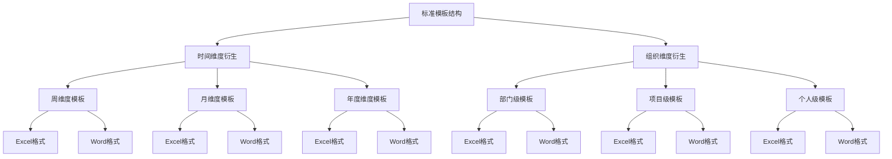

## 产品概述

生成一套完整的重点工作总结计划任务模板套表，基于标准模板衍生出不同时间维度（周、月、年度）和组织架构维度（部门级、项目级、个人级）的模板体系。

## 核心功能

- **时间维度模板**：周维度（周工作总结与计划）、月维度（月度工作总结与计划）、年度维度（年度重点工作计划）
- **组织架构维度模板**：部门级（各部门/中心层面）、项目级（各项目公司层面）、个人级（个人工作层面）
- **双格式输出**：Excel格式（.xlsx，便于填写和汇总）和 Word 格式（.docx，便于汇报和存档）
- **表格美化**：应用城发投财务表格排版标准和 Word 文档排版标准
- **直接可用**：填充示例数据，用户可以直接参考修改

## 输出文件清单（共18个）

1. 周维度_部门级_工作总结计划模板.xlsx/.docx
2. 周维度_项目级_工作总结计划模板.xlsx/.docx
3. 周维度_个人级_工作总结计划模板.xlsx/.docx
4. 月维度_部门级_工作总结计划模板.xlsx/.docx
5. 月维度_项目级_工作总结计划模板.xlsx/.docx
6. 月维度_个人级_工作总结计划模板.xlsx/.docx
7. 年度维度_部门级_重点工作计划模板.xlsx/.docx
8. 年度维度_项目级_重点工作计划模板.xlsx/.docx
9. 年度维度_个人级_重点工作计划模板.xlsx/.docx

## 技术方案

### 技术栈选择

- **Python 3.x**：核心开发语言
- **openpyxl**：Excel 文件生成与格式化
- **python-docx**：Word 文档生成与格式化
- **pandas**：数据处理与结构化

### 实施方法

#### 1. 标准模板结构设计

基于现有《【鹤壁城市发展投资有限公司】4.2026年度重点工作计划.xlsx》格式，设计通用标准模板结构：

**通用字段体系**：

- 序号：工作排序
- 工作类别：工作分类（财务管理、融资管理、预算管理等）
- 工作内容：具体工作描述
- 责任主体：负责部门/项目公司/个人
- 配合部门：协助部门
- 开始时间：工作启动时间
- 完成时限：工作完成截止时间
- 进度状态：未开始/进行中/已完成/延期
- 完成情况/计划安排：具体完成情况或下一步计划
- 备注：补充说明

#### 2. 时间维度差异化设计

**周维度模板特点**：

- 聚焦本周完成情况和下周工作计划
- 增加"本周完成情况"和"下周工作计划"分栏
- 周期短，快速迭代

**月维度模板特点**：

- 聚焦本月完成情况和下月工作计划
- 增加"本月完成情况"和"下月工作计划"分栏
- 增加月度数据统计（完成率、达成率）
- 中期进度跟踪

**年度维度模板特点**：

- 聚焦全年重点工作
- 按季度分解（Q1、Q2、Q3、Q4）
- 增加"年度目标"和"季度分解"栏
- 长期战略规划

#### 3. 组织维度差异化设计

**部门级模板**：

- 责任主体为部门/中心（财务部、融资部、清洁供能部等）
- 关注部门整体工作
- 审批流程：部门主任审核

**项目级模板**：

- 责任主体为项目公司（鹤壁城发、许昌城发、南阳城发等）
- 关注项目具体进展
- 审批流程：项目经理审核

**个人级模板**：

- 责任主体为个人姓名
- 关注个人工作任务
- 审批流程：主管审核

#### 4. Excel 表格美化方案

**表头设计**：

- 深蓝色背景（#1F4E79）
- 白色字体，11号微软雅黑加粗
- 表头行高 30 磅

**内容设计**：

- 10号微软雅黑字体
- 内容行高 22 磅
- 细边框，单元格换行对齐

**颜色区分**：

- 绿色（#C6EFCE）：常规事项
- 黄色（#FFEB9C）：例外事项
- 红色（#FFC7CE）：重要事项

**自适应设置**：

- 列宽根据内容自适应
- 增加颜色图例工作表

#### 5. Word 文档排版方案

**标题设计**：

- 一级标题：方正小标宋简体，22号，不加粗
- 二级标题：黑体，16号，不加粗
- 三级标题：楷体，16号，不加粗

**正文设计**：

- 仿宋，16号，不加粗
- 行间距：固定值 30 磅
- 段前段后：0 行

#### 6. 示例数据填充策略

为确保所有模板直接可用，每个模板填充 3-5 条示例数据：

- 周维度：示例数据体现本周完成和下周计划
- 月维度：示例数据体现本月完成和下月计划、月度统计
- 年度维度：示例数据体现年度目标和季度分解

### 架构设计



### 目录结构

```
重点工作计划及问题清单/
├── 模板套表/
│   ├── 周维度_部门级_工作总结计划模板.xlsx
│   ├── 周维度_部门级_工作总结计划模板.docx
│   ├── 周维度_项目级_工作总结计划模板.xlsx
│   ├── 周维度_项目级_工作总结计划模板.docx
│   ├── 周维度_个人级_工作总结计划模板.xlsx
│   ├── 周维度_个人级_工作总结计划模板.docx
│   ├── 月维度_部门级_工作总结计划模板.xlsx
│   ├── 月维度_部门级_工作总结计划模板.docx
│   ├── 月维度_项目级_工作总结计划模板.xlsx
│   ├── 月维度_项目级_工作总结计划模板.docx
│   ├── 月维度_个人级_工作总结计划模板.xlsx
│   ├── 月维度_个人级_工作总结计划模板.docx
│   ├── 年度维度_部门级_重点工作计划模板.xlsx
│   ├── 年度维度_部门级_重点工作计划模板.docx
│   ├── 年度维度_项目级_重点工作计划模板.xlsx
│   ├── 年度维度_项目级_重点工作计划模板.docx
│   ├── 年度维度_个人级_重点工作计划模板.xlsx
│   └── 年度维度_个人级_重点工作计划模板.docx
└── 颜色图例说明.xlsx
```

### 实施注意事项

1. **性能优化**：

- 使用 openpyxl 的优化模式（write-only mode）处理大文件
- 避免重复格式化操作

2. **格式一致性**：

- 所有 Excel 文件统一应用城发投财务表格排版标准
- 所有 Word 文件统一应用城发投文档排版标准

3. **直接可用性**：

- 所有模板填充示例数据
- 下拉选项预设常用值（工作类别、进度状态等）
- 提供填写说明工作表（Excel）或填写说明章节（Word）

4. **临时文件清理**：

- 按照用户规范（记忆 ID: 43186223），临时 Python 脚本使用后立即删除
- 只保留生成的模板文件

# Agent Extensions

<!-- 本任务不需要使用 Agent Extensions，因此不输出 <extensions> 标签 -->